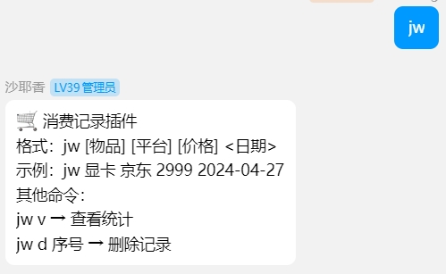
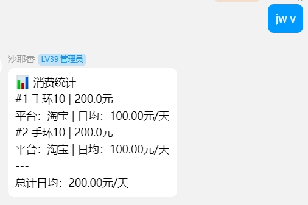

# SpendFlowPlugin

<p align="center">  </p>
<p align="center">  </p>

加群push群主更新，反馈bug,交流

[](https://qm.qq.com/cgi-bin/qm/qr?k=en97YqjfYaLpebd9Nn8gbSvxVrGdIXy2&jump_from=webapi&authKey=41BmkEjbGeJ81jJNdv7Bf5EDlmW8EHZeH7/nktkXYdLGpZ3ISOS7Ur4MKWXC7xIx)

## 安装

配置完成 [LangBot](https://github.com/RockChinQ/LangBot) 主程序后使用管理员账号向机器人发送命令即可安装：

```
!plugin get https://github.com/sheetung/SpendFlow.git
```
或查看详细的[插件安装说明](https://docs.langbot.app/plugin/plugin-intro.html#%E6%8F%92%E4%BB%B6%E7%94%A8%E6%B3%95)

## 使用

使用命令`jw`或`/jw`触发帮助使用

## 更新历史

- v1.1 初始化基础功能
